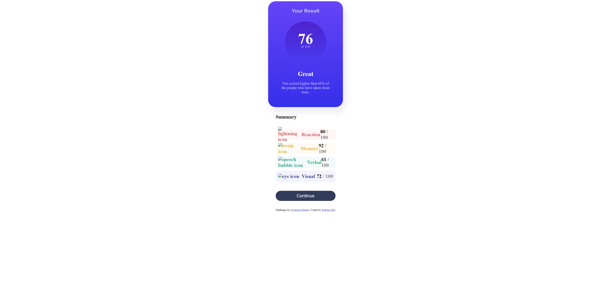

# Frontend Mentor - Results summary component solution

This is a solution to the [Results summary component challenge on Frontend Mentor](https://www.frontendmentor.io/challenges/results-summary-component-CE_K6s0maV). Frontend Mentor challenges help you improve your coding skills by building realistic projects. 

## Table of contents

- [Overview](#overview)
  - [The challenge](#the-challenge)
  - [Screenshot](#screenshot)
  - [Links](#links)
- [Author](#author)

## Overview

Hello All, this is my solution to this frontend challenge. This is my first challenge on Frontend Mentor and I really enjoyed it. I'm proud of my work, and grateful for the opportunity to learn through this platform.

### The challenge

Users should be able to:

- View the optimal layout for the interface depending on their device's screen size
- See hover and focus states for all interactive elements on the page

### Screenshot

### Links

- Solution URL: [Add solution URL here](https://your-solution-url.com)
- Live Site URL: [Add live site URL here](https://your-live-site-url.com)

### Built with

- Semantic HTML5 markup
- CSS custom properties
- Flexbox
- CSS Grid

### Continued development

I want to continue focusing on HTML and CSS as I have spent more time on backend development. My goal is to become more of a full-stack developer. I would like to dig deeper into CSS to spend quite a bit more attention on it.

## Author

- Github - [Katrina Hill](https://github.com/katrina-l-hill)
- Frontend Mentor - [@katrina-l-hill](https://www.frontendmentor.io/profile/katrina-l-hill)
